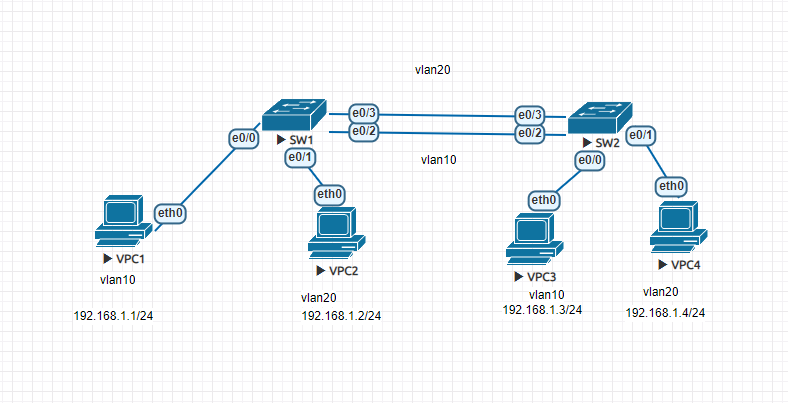

vlan

```
//PC1
ip 192.168.1.1 255.255.255.0
//PC2
ip 192.168.1.2 255.255.255.0
//PC3
ip 192.168.1.3 255.255.255.0
//PC4
ip 192.168.1.4 255.255.255.0
```
sw
```
//SW1、SW2分別輸入
(config)#vlan 10
(config-vlan)#name Vlan10
(config-vlan)#exit
(config)#vlan 20
(config-vlan)#name Vlan20

(config)#int range e0/0,e0/2
(config-if-range)#sw mode access
(config-if-range)#sw access vlan 10
(config-if-range)#int range e0/1,e0/3
(config-if-range)#sw mode access
(config-if-range)#sw access vlan 20
```