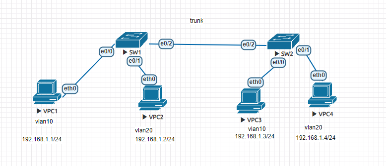

trunk

set vpc ip
```
//PC1
ip 192.168.1.1 255.255.255.0

//PC2
ip 192.168.1.2 255.255.255.0

//PC3
ip 192.168.1.3 255.255.255.0

//PC4
ip 192.168.1.4 255.255.255.0
```
vlan
```
//SW1 SW2
(config)#vlan 10
(config-vlan)#name Vlan10
(config-vlan)#exit
(config)#vlan 20
(config-vlan)#name Vlan20
(config-vlan)#int e0/0
(config-if)#sw mode access
(config-if)#sw access vlan 10
(config-if)#int e0/1
(config-if)#sw mode access
(config-if)#sw access vlan 20
```
trunk
```
//SW1 SW2
(config)#int e0/2
(config-if)#switchport trunk encapsulation dot1q
(config-if)#switchport mode trunk

