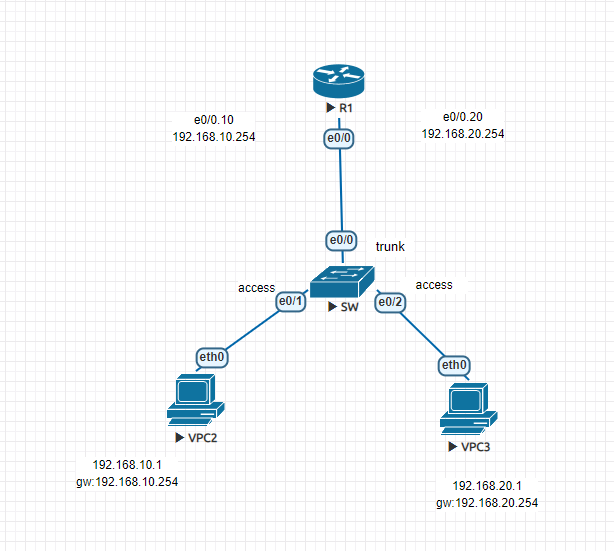
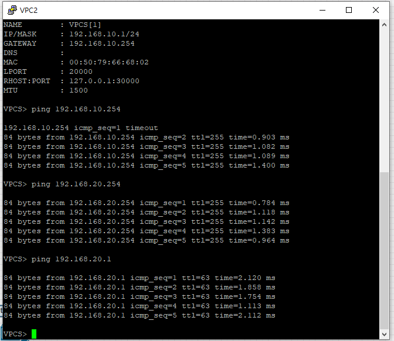
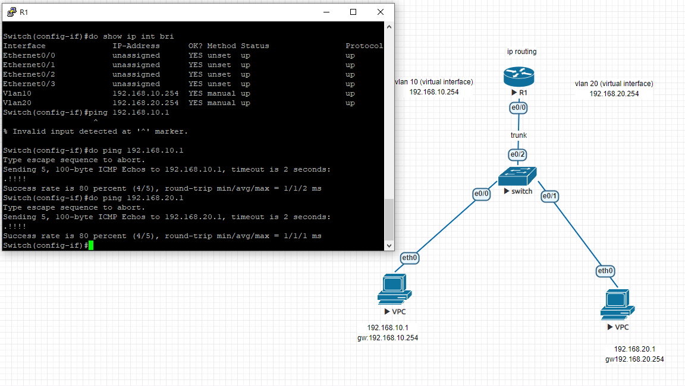

單臂路由

```
//PC1
ip 192.168.10.1 255.255.255.0 192.168.10.254

//PC2
ip 192.168.20.1 255.255.255.0 192.168.20.254
SW setting vlan
```
switch set vlan
```
Switch(config)#vlan 10
Switch(config-vlan)#exit
Switch(config)#vlan 20
Switch(config-vlan)#exit
Switch(config)#int e0/0
Switch(config-if)#switchport trunk encapsulation dot1q
Switch(config-if)#switchport mode trunk
Switch(config-if)#int e0/1
Switch(config-if)#switchport access vlan 10
Switch(config-if)#switchport mode access
Switch(config-if)#int e0/2
Switch(config-if)#switchport access vlan 20
Switch(config-if)#switchport mode access
```
router setting
```
Router(config)#int e0/0
Router(config-if)#no shut
Router(config-if)#int e0/0.10
Router(config-subif)#encapsulation dot1Q 10
Router(config-subif)#ip addr 192.168.10.254 255.255.255.0
Router(config-subif)#int e0/0.20
Router(config-subif)#encapsulation dot1Q 20
Router(config-subif)#ip addr 192.168.20.254 255.255.255.0
```
pc1 ping


do show vlan brief
do show ip int brief


SW1
```
Switch(config)int range e0/0,e0/1
Switch(config-if)#switchport trunk encapsulation dot1q
Switch(config-if)#switchport mode trunk 
Switch(config)#vtp mode server
Switch(config)#vtp domain CCNA
Switch(config)#vtp password cisco
Switch(config)#vlan 10
Switch(config)#vlan 20
Switch(config)#vlan 30
```
SW2
```
Switch(config)int range e0/0,e0/1
Switch(config-if)#switchport trunk encapsulation dot1q
Switch(config-if)#switchport mode trunk 
Switch(config)#vtp mode client
Switch(config)#vtp domain CCNA
Switch(config)#vtp password cisco
```
SW3 
Switch(config)int e0/0
Switch(config-if)#switchport trunk encapsulation dot1q
Switch(config-if)#switchport mode trunk 
Switch(config)#vtp mode client
Switch(config)#vtp domain CCNA
Switch(config)#vtp password cisco
Switch(config-if)#int e0/1
Switch(config-if)#switchport access vlan 10
Switch(config-if)#switchport mode access

```
//router
router(config)#int e0/1
router(config-if)#ip adddr 192.168.100.254 255.255.255.0
router(config-if)#no shut
router(config)#int e0/0
router(config-if)#ip addr 192.168.10.254 255.255.255.0
router(config-if)#no shut
Router(config-if)#int e0/0.10
Router(config-subif)#encapsulation dot1q 10
Router(config-subif)#ip addr 192.168.10.254 255.255.255.0
Router(config-subif)#int e0/0.20
Router(config-subif)#encapsulation dot1q 20
Router(config-subif)#ip addr 192.168.20.254 255.255.255.0
Router(config-subif)#int e0/0.30
Router(config-subif)#encapsulation dot1q 30
Router(config-subif)#ip addr 192.168.30.254 255.255.255.0
```
sw1
```
// sw1

Switch(config-if)#int e0/2
Switch(config-if)#switchport access vlan 20
Switch(config-if)#switchport mode access
Switch(config-if)#int e0/3
Switch(config-if)#switchport access vlan 30
Switch(config-if)#switchport mode access
//sw2
Switch(config-if)#int e0/2
Switch(config-if)#switchport access vlan 10
Switch(config-if)#switchport mode access
Switch(config-if)#int e0/3
Switch(config-if)#switchport access vlan 20
Switch(config-if)#switchport mode access
Switch(config-if)#int e1/0
Switch(config-if)#switchport access vlan 30
Switch(config-if)#switchport mode access
//sw3
Switch(config-if)#int e0/1
Switch(config-if)#switchport access vlan 10
Switch(config-if)#switchport mode access
7台vpc
ip 192.168.10.1 255.255.255.0 192.168.10.254
ip 192.168.10.2 255.255.255.0 192.168.10.254
ip 192.168.20.1 255.255.255.0 192.168.20.254
ip 192.168.20.2 255.255.255.0 192.168.20.254
ip 192.168.30.1 255.255.255.0 192.168.30.254
ip 192.168.30.2 255.255.255.0 192.168.30.254
ip 192.168.100.1 255.255.255.0 192.168.100.254


layer 3 switch

//pc1
ip 192.168.10.1 255.255.255.0 192.168.10.254
//pc2
ip 192.168.20.1 255.255.255.0 192.168.20.254

switch l2

int e0/0
switchprot access vlan 10
switchport mode access

int e0/1
switchprot access vlan 20
switchport mode access

int e0/2 
switchport trunk encapsulation dot1q
switchport mode trunk

switch l3 (選節點的時候一樣選l2就好)
ine e0/0
switchport trunk encapsulation dot1q
switchport mode trunk
ip routing 啟動路由
vlan 10
vlan 20
int vlan 10
ip addr 192.168.10.254 255.255.255.0
no shut
int vlan 20
ip addr 192.168.20.254 255.255.255.0
no shut
do show ip intergace brief

