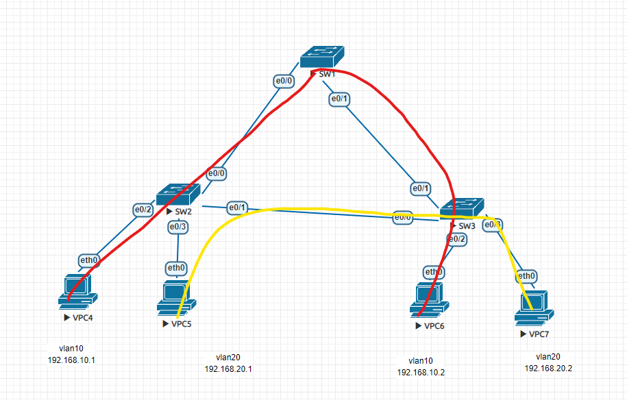
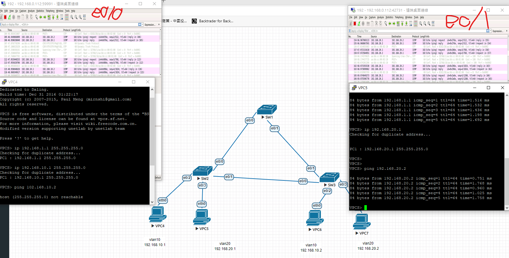
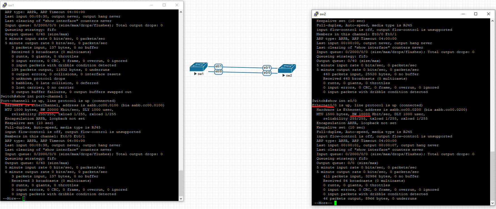

# STP
交換機如果有很多連線可以做eth channel 加大頻寬、容錯
原本使用的線路如果斷線要等一段時間等新的路由生成

設置vpc ip
//ip
ip 192.168.10.1 255.255.255.0
ip 192.168.20.1 255.255.255.0
ip 192.168.10.2 255.255.255.0
ip 192.168.20.2 255.255.255.0
四個與vpc的介面 access vlan
//sw2 及sw3
(config)#int  e0/2
(config-if-range)#sw mode access
(config-if-range)#sw access vlan 10
(config-if-range)#int e0/3
(config-if-range)#sw mode access
(config-if-range)#sw access vlan 20

switch 與switch 的介面 trunk
//sw1 sw2 sw3
(config)#int range e0/0,e0/1
(config-if)#switchport trunk encapsulation dot1q
(config-if)#switchport mode trunk

sw 2
spanning-tree vlan 20 priority 8192(把sw2變成 vlan20的根)
有時候trunk會有sw1沒有vlan的bug 要在sw1 config模式補vlan10、vlan10

# ether channel

//sw1 ,sw2
int range e0/0,e0/1
switchport trunk encapsulation dot1q
switchprot mode trunk
channle1-group 1 mode on

show etherchannel summary
show int port-channel

