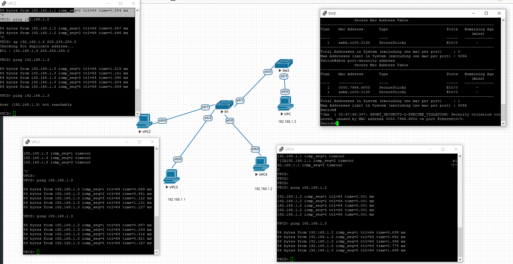
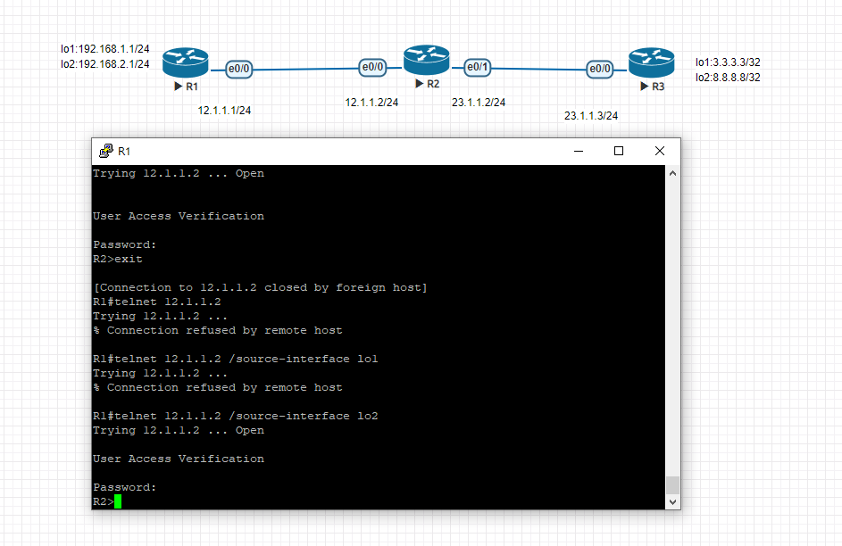

介紹中間人攻擊
port security
//pc
ip 192.168.1.1 255.255.255.0
ip 192.168.1.2 255.255.255.0
ip 192.168.1.3 255.255.255.0
/sw
int e0/0(要防護的那個port)
switchport mode access

switchprot port-security maximum 1 (設定有多少mac可以用)
show port-security interface  0/0
switchport port-security mac-address  1234.5678.2234(看pc裡的mac格式為0000.0000.0000)
switchprot port-security violation shutdown
show port-secutiry address

int e0/0
switchport mode access
switchprot port-security maximum 3
switchport port-security mac-address sticky
switchprot port-security violation restrict
被port-security shutdown的介面要先 再shut 然後no shut 才可重啟

access control list
//r1
int e0/0
ip addr 12.1.1.1 255.255.255.0
no shut
int lo1
ip addr 192.168.1.1 255.255.255.0
no shut
int lo2
ipa addr 192.168.2.1 255.255.255.0
no shut
router rip 
version 2
no auto-summary
network 12.1.1.0
network 192.168.1.0
network 192.168.2.0

//r2
int e0/0 
ip addr 12.1.1.2 255.255.255.0
no shut
int e0/1
ip addr 23.1.1.2 255.255.255.0
no shut
router rip 
version 2
no auto-summary
network 12.1.1.0
network 23.1.1.0

//r3
int e0/0
ip addr 23.1.1.3 255.255.255.0
no shut
int lo1
ip addr 3.3.3.3 255.255.255.255
no shut
int lo2 
ip addr 8.8.8.8 255.255.255.255
no shut
router rip
no auto-summary
network 23.1.1.0
network 3.3.3.0
network 8.8.8.0

ping b.b.b.b source a.a.a.a (from a ping to b)

//r2
access-list 1 deny 192.168.2.0 0.0.0.255
access-list 1 permit any
int e0/0
ip access-group 1 in

//R2
line vty 0 4
password cisco
login 
transport input telnet
exit
access-list 2 permit host 192.168.2.1
line vty 0 4
access-class 2 in

//R1 
telnet 12.1.1.2 /source-interface lo2

