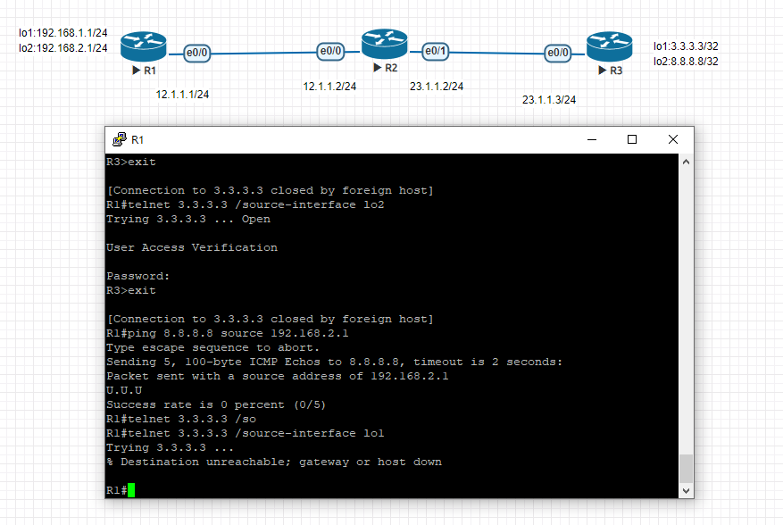
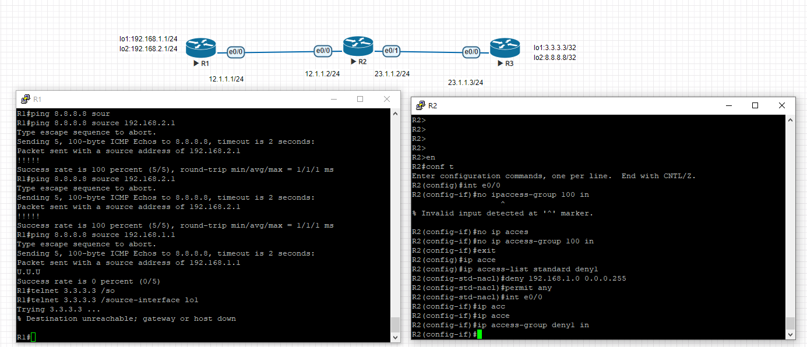
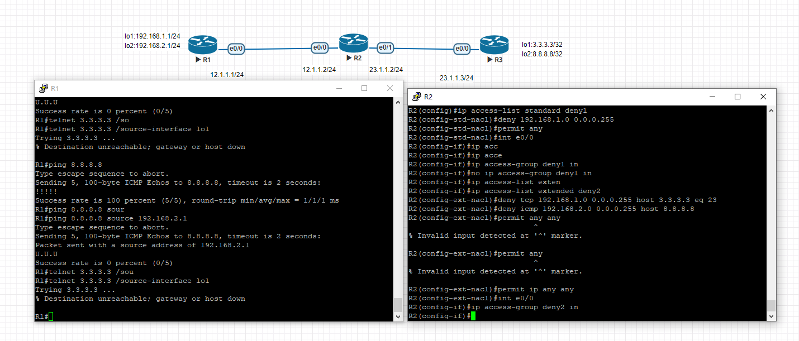

在r2部屬編號擴展acl使得192.168.1.0/24不能訪問外網主機3.3.3.3 的port23
192.168.2.0/24不能 ping 8.8.8.8
//r1
int e0/0
ip addr 12.1.1.1 255.255.255.0
no shut
int lo1
ip addr 192.168.1.1 255.255.255.0
no shut
int lo2
ipa addr 192.168.2.1 255.255.255.0
no shut
router rip 
version 2
no auto-summary
network 12.1.1.0
network 192.168.1.0
network 192.168.2.0

//r2
int e0/0 
ip addr 12.1.1.2 255.255.255.0
no shut
int e0/1
ip addr 23.1.1.2 255.255.255.0
no shut
router rip 
version 2
no auto-summary
network 12.1.1.0
network 23.1.1.0

//r3
int e0/0
ip addr 23.1.1.3 255.255.255.0
no shut
int lo1
ip addr 3.3.3.3 255.255.255.255
no shut
int lo2 
ip addr 8.8.8.8 255.255.255.255
no shut
router rip
no auto-summary
network 23.1.1.0
network 3.3.3.0
network 8.8.8.0

//r3
line vty 0 4
password cisco
login
transport input telnet 

//r2
access-list 100 deny tcp 192.168.1.0 0.0.0.255 host 3.3.3.3 eq 23
access-list 100 deny icmp 192.168.2.0 0.0.0.255 host 8.8.8.8
access-list 100 permit ip any any
int e0/0
ip access-group 100 in
do show runn

命名acl
在r2上部屬命名acl,使得內網192.168.1.0/24不能訪問外網其他可以
先取消上個實驗的設定
//r2
int e0/0
no ip access-group 100 in
exit
ip access-list standard deny1
deny 192.168.1.0 0.0.0.255
permit any
int e0/0 
ip access-group deny1 in

命名擴展acl
no ip access-group deny1 in
ip access-list extended deny2
deny tcp 192.168.1.0 0.0.0.255 host 3.3.3.3 eq 23
deny icmp 192.168.2.0 0.0.0.255 host 8.8.8.8
permit any any
int e0/0
ip access-group deny2 in

NAT

先在r2
int e0/0
no ip access-group deny2 in

//r1 
ip route 0.0.0.0 0.0.0.0 12.1.1.2
//r2
ip route 192.168.1.0 255.255.255.0 12.1.1.1
ip route 192.168.2.0 255.255.255.0 12.1.1.1
ip route 0.0.0.0 0.0.0.0 23.1.1.3
//r2
access-list 1 permit 192.168.1.0 0.0.0.255
access-lset 2 permit 192.168.2.0 0.0.0.255
ip nat pool DNAT 23.1.1.100 23.1.1.200 netmask 255.255.255.0
int e0/0
ip nat inside
int e0/1
ip nat outside
exit
ip nat inside soucre list 1 pool DNAT
ip nat inside soucre list 2 pool DNAT

debug ip nat
show ip nat
show ip nat translations

只有一個對外ip
iP nat pool PAT 23.1.1.2 23.1.1.2 netmask 255.255.255.0
no ip nat inside source list 1 pool DNAT
yes

ip nat inside source list 1 pool PAT overload
