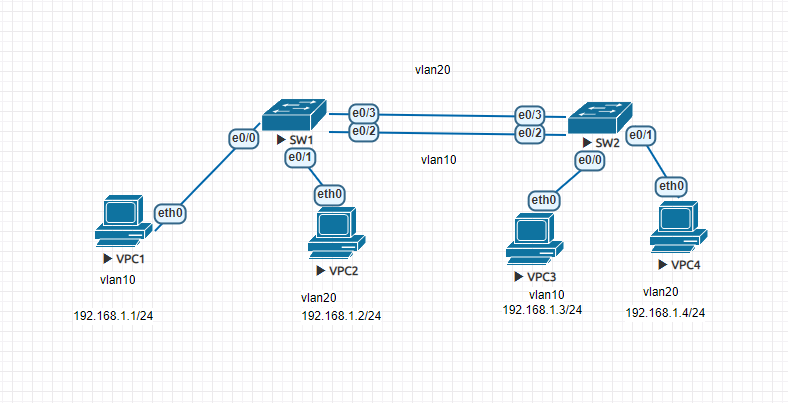
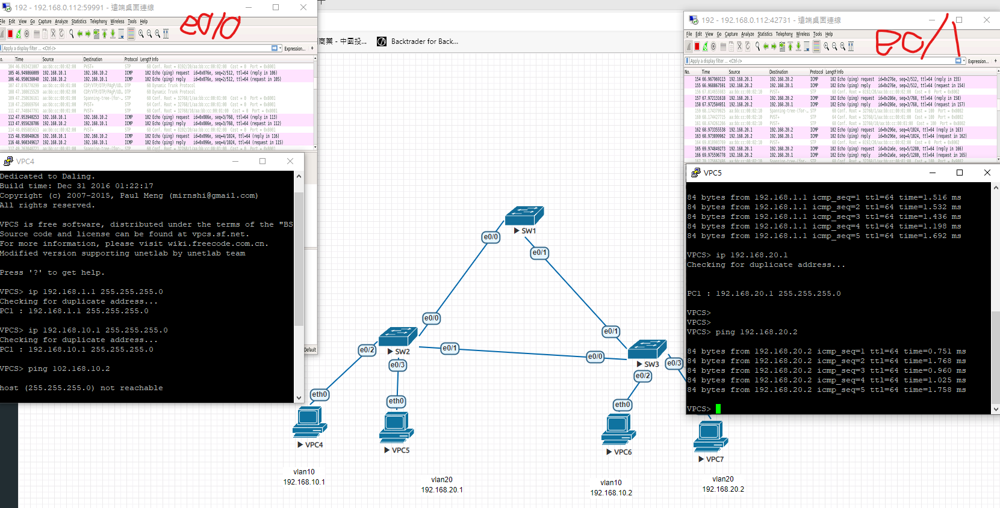
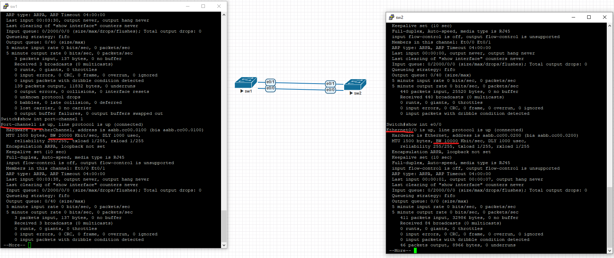

# 0928
* >:user mode
* \# :privilege mode 輸入enable 進入特權模式
* config :golbal configuration mode 輸入config t
* 都是用exit回到上層 在接口想直接回到privilege mode 可以用end
* nvram 中有一個start configure 剛開機的時候會去讀取它 若要重開時配置還在，要把running configure 寫回去start configure
ping的時候 !代表封包傳送成功
第一個封包要arp解析(要網路卡卡號)通常會失敗
```
在router中設定
interface e0/0
ip addr 192.168.1.254 255.255.255.0
no shut
interface e0/1
ip addr 192.168.2.254 255.255.255.0
no shut
do show ip interface brief
在pc1 ip 192.168.1.1 255.255.255.0 192.168.1.254
  pc2 ip 192.168.2.1 255.255.255.0 192.168.2.254
  從pc2 ping 192.168.1.1 or pc1 ping 192.168.1.1
 ``` 
 ```
 設定dhcp
 在router
 ip dhcp pool mypool
 netwrok 192.168.1.0 255.255.255.0
 default-router 192.168.1.254 
 dns-server 8.8.8.8
 dns-server exclude 192.168.1.250 192.168.1.254 (排除一些不想分配出去的ip)
 
 ip dhcp pool mypoo2
 netwrok 192.168.2.0 255.255.255.0
 default-router 192.168.2.254
 dns-server 8.8.8.8
 dns-server exclude 192.168.2.250 192.168.2.254
 
 clear ip 清除ip
 pc端中 打 ip dhcp
 ```
 ```
 
 在router中
 int e0/2
 ip addr dhcp
 no shut
 do show ip int brief
 username cisco password cisco
 enable secret cisco
 ip domain-name test.com
 hostname R1
 crypto key generate rsa
 ip ssh version 2
 line vty 0 4   (設置遠端可以有五個帳戶登入0~4)                        
 login local                          
 transport input ssh  
 ```
 enable ?   
 password 密碼明文顯示在configure   
 secret 密碼在configure中會加密   
 show ip dhcp binding顯示shcpserver 送出的資訊   
-line vty
看設定備配置   
show running-configure   
設定配置(讓重開後配置不會跑掉)   
write memory   
ctrl+a 可以讓游標移動到最左邊，ctrl+可以讓游標移到最右邊(linux也是)   

# 1005

## TFTP
* 簡單檔案傳輸協定也稱小型檔案傳輸協定（Trivial File Transfer Protocol, TFTP）。
* 透過少量記憶體就能輕鬆實現

## OpenWrt
* OpenWrt是適合於嵌入式裝置的一個Linux發行版。
* 不是一個單一、靜態的韌體，而是提供了一個可添加軟體套件的可寫的檔案系統。

## 參考資料
* [[CentOS 7] 檔案傳輸界的隱形冠軍 - TFTP 伺服器](http://blog.itist.tw/2016/09/install-a-tftp-server-on-centos-7.html)
## 實驗一
```
virtual machine:

sudo yum install -y xinted tftp-server
sudo vim /etc/xinetd.d/tftp
:
server_args = -c -s /var/lib/tftpboot
diable      = no
:
sudo chmod 777 /var/lib/tftpboot
```
## 實驗二
* 可直接對序列阜，因為serial一對一
```
# R1
enable
configure terminal
hostname R1
intreface s1/0
ip addr 12.1.1.1 255.255.255.0
no shutdown

# R2
enable
configure terminal
hostname R2
intreface s1/0
ip addr 12.1.1.2 255.255.255.0
no shutdown
interface s1/1
ip addr 23.1.1.2 255.255.255.0
no shutdown

# R3
enable
configure terminal
hostname R3
intreface s1/0
ip addr 23.1.1.3 255.255.255.0
no shutdown

# R1
router ospf 1
network 12.1.1.0 0.0.0.255 area 0

# R2
router ospf 1
network 12.1.1.0 0.0.0.255 area 0
network 23.1.1.0 0.0.0.255 area 0

# R3
router ospf 1
network 23.1.1.0 0.0.0.255 area 0

# R1
ping 12.1.1.2 # 此時應該會 ping 通

#R3
ping 12.1.1.1 # 此時應該會ping 通

```

# 1019
* r1
```
Router>en
Router#conf t
Router(config)#hostname r1
r1(config)#int e0/0
r1(config-if)#ip addr 12.1.1.1 255.255.255.0
r1(config-if)#no shut
r1(config-if)#exit
r1(config)#router rip
r1(config-router)#network 12.0.0.0
r1(config-router)#do show ip int brief
r1(config)#do show ip route
r1(config)#exit
----等r2 r3設置完成 ----
r1#ping 23.1.1.3

```
* r2
```
Router>en
Router#conf t
Router(config)#hostname r2
r2(config)#int e0/0
r2(config-if)#ip addr 12.1.1.2 255.255.255.0
r2(config-if)#no shut
r2(config-if)#int
r2(config-if)#int e0/1
r2(config-if)#ip addr 23.1.1.2 255.255.255.0
r2(config-if)#no shut
r2(config-if)#exit
r2(config)#router rip
r2(config-router)#network 12.0.0.0
r2(config-router)#network 23.0.0.0
r2(config-router)#do show ip int brief
```
* r3
```
Router>en
Router#conf t
Router(config)#hostname r3
r3(config)#int e0/0
r3(config-if)#ip addr 23.1.1.3 255.255.255.0
r3(config-if)#no shut
r3(config-if)#exit
r3(config)#router rip
r3(config-router)#network 23.0.0.0
r3(config)#do show ip route
```
# 1025
192.168.3.10/22是否可以連到192.168.4.10/22，可以，但要透過router
## RIP
v1 有類路由協議 不須傳遮罩
v2 無淚路由協議 需傳遮罩
do clear ip route 刪除舊有的ip route
do show ip route
## EIGRP
## DSPF
## SDN
* software defined network

# 1102

eigrp 由cisco 提出  
路由協定可分為 distance-vector和 link-state  
loop-free 環路依然存在，但不會經過  
想要知道介面的資訊$show interfaces 介面名稱

* r1
```
en 
conf t
hostname R1
int e0/0
ip addr 12.1.1.1 255.255.255.0
no shut
exit
```
* r2
```
en
conf t
hostname R2
int e0/0
ip addr 12.1.1.2 255.255.255.0
no shut
int e0/1
ip addr 23.1.1.2 255.255.255.0
no shut
```
* r3
```
en 
conf t
hostname R3
int e0/0
ip addr 23.1.1.3 255.255.255.0
no shut
```
* r1
```
router eigrp 10
network 12.1.1.0 0.0.0.255
```
* r2
```
router eigrp 10
network 12.1.1.0 0.0.0.255
network 23.1.1.0 0.0.0.255
```
* r3
```
router eigrp 10
network 23.1.1.0 0.0.0.255
```
> show ip eigrp neighbors

> show ip eigrp topology

* r1
 ```
 en
 conf t
 int lo1
 ip adr 172.16.0.1 255.255.255.0
 router eigrp 10
 network 172.16.0.0 0.0.0.255
 ```
 * r3
 ```
 en
 conf t
 int lo1
 ip addr 172.16.1.1 255.255.255.0
 router eigrp 10
 network 172.16.1.0 0.0.0.255
 ```
 > no auto-summary

 ### 手動合併網路
 * r1
 ```
 en
 conf t
 int lo2
 ip addr 172.16.4.1 255.255.255.0
 ip addr 172.16.5.1 255.255.255.0 secondary
 int e0/0
 ip summary address eigrp 10 172.16.4.0 255.255.254.0
 router eigrp 10
 network 172.16.4.0 0.0.0.255
 network 172.16.5.0 0.0.0.255
 ```
 ### 認證的實驗
 * r1
 ```
 en
 conf t
 key chain Mychain
 key 1
 key string 123456
 int e0/0
 ip authentication key-chain eigrp 10 Mychain
 ip authentication mode eigrp 10 md5
 ```
 * r2
 ```
 en
 conf t
 key chain Mychain
 key 1
 key string 123456
 int e0/0
 ip authentication key-chain eigrp 10 Mychain
 ip authentication mode eigrp 10 md5
 ```
 
# 1116
vlan

```
//PC1
ip 192.168.1.1 255.255.255.0
//PC2
ip 192.168.1.2 255.255.255.0
//PC3
ip 192.168.1.3 255.255.255.0
//PC4
ip 192.168.1.4 255.255.255.0
```
sw
```
//SW1、SW2分別輸入
(config)#vlan 10
(config-vlan)#name Vlan10
(config-vlan)#exit
(config)#vlan 20
(config-vlan)#name Vlan20

(config)#int range e0/0,e0/2
(config-if-range)#sw mode access
(config-if-range)#sw access vlan 10
(config-if-range)#int range e0/1,e0/3
(config-if-range)#sw mode access
(config-if-range)#sw access vlan 20
```
# 1123
trunk

set vpc ip
```
//PC1
ip 192.168.1.1 255.255.255.0

//PC2
ip 192.168.1.2 255.255.255.0

//PC3
ip 192.168.1.3 255.255.255.0

//PC4
ip 192.168.1.4 255.255.255.0
```
vlan
```
//SW1 SW2
(config)#vlan 10
(config-vlan)#name Vlan10
(config-vlan)#exit
(config)#vlan 20
(config-vlan)#name Vlan20
(config-vlan)#int e0/0
(config-if)#sw mode access
(config-if)#sw access vlan 10
(config-if)#int e0/1
(config-if)#sw mode access
(config-if)#sw access vlan 20
```
trunk
```
//SW1 SW2
(config)#int e0/2
(config-if)#switchport trunk encapsulation dot1q
(config-if)#switchport mode trunk
```

# 1130
單臂路由

```
//PC1
ip 192.168.10.1 255.255.255.0 192.168.10.254

//PC2
ip 192.168.20.1 255.255.255.0 192.168.20.254
SW setting vlan
```
switch set vlan
```
Switch(config)#vlan 10
Switch(config-vlan)#exit
Switch(config)#vlan 20
Switch(config-vlan)#exit
Switch(config)#int e0/0
Switch(config-if)#switchport trunk encapsulation dot1q
Switch(config-if)#switchport mode trunk
Switch(config-if)#int e0/1
Switch(config-if)#switchport access vlan 10
Switch(config-if)#switchport mode access
Switch(config-if)#int e0/2
Switch(config-if)#switchport access vlan 20
Switch(config-if)#switchport mode access
```
router setting
```
Router(config)#int e0/0
Router(config-if)#no shut
Router(config-if)#int e0/0.10
Router(config-subif)#encapsulation dot1Q 10
Router(config-subif)#ip addr 192.168.10.254 255.255.255.0
Router(config-subif)#int e0/0.20
Router(config-subif)#encapsulation dot1Q 20
Router(config-subif)#ip addr 192.168.20.254 255.255.255.0
```
pc1 ping


do show vlan brief
do show ip int brief


SW1
```
Switch(config)int range e0/0,e0/1
Switch(config-if)#switchport trunk encapsulation dot1q
Switch(config-if)#switchport mode trunk 
Switch(config)#vtp mode server
Switch(config)#vtp domain CCNA
Switch(config)#vtp password cisco
Switch(config)#vlan 10
Switch(config)#vlan 20
Switch(config)#vlan 30
```
SW2
```
Switch(config)int range e0/0,e0/1
Switch(config-if)#switchport trunk encapsulation dot1q
Switch(config-if)#switchport mode trunk 
Switch(config)#vtp mode client
Switch(config)#vtp domain CCNA
Switch(config)#vtp password cisco
```
SW3 
```
Switch(config)int e0/0
Switch(config-if)#switchport trunk encapsulation dot1q
Switch(config-if)#switchport mode trunk 
Switch(config)#vtp mode client
Switch(config)#vtp domain CCNA
Switch(config)#vtp password cisco
Switch(config-if)#int e0/1
Switch(config-if)#switchport access vlan 10
Switch(config-if)#switchport mode access
```
```
//router
router(config)#int e0/1
router(config-if)#ip adddr 192.168.100.254 255.255.255.0
router(config-if)#no shut
router(config)#int e0/0
router(config-if)#ip addr 192.168.10.254 255.255.255.0
router(config-if)#no shut
Router(config-if)#int e0/0.10
Router(config-subif)#encapsulation dot1q 10
Router(config-subif)#ip addr 192.168.10.254 255.255.255.0
Router(config-subif)#int e0/0.20
Router(config-subif)#encapsulation dot1q 20
Router(config-subif)#ip addr 192.168.20.254 255.255.255.0
Router(config-subif)#int e0/0.30
Router(config-subif)#encapsulation dot1q 30
Router(config-subif)#ip addr 192.168.30.254 255.255.255.0
```
sw1
```
// sw1
Switch(config-if)#int e0/2
Switch(config-if)#switchport access vlan 20
Switch(config-if)#switchport mode access
Switch(config-if)#int e0/3
Switch(config-if)#switchport access vlan 30
Switch(config-if)#switchport mode access
```
sw2
```
Switch(config-if)#int e0/2
Switch(config-if)#switchport access vlan 10
Switch(config-if)#switchport mode access
Switch(config-if)#int e0/3
Switch(config-if)#switchport access vlan 20
Switch(config-if)#switchport mode access
Switch(config-if)#int e1/0
Switch(config-if)#switchport access vlan 30
Switch(config-if)#switchport mode access
```
sw3
```
Switch(config-if)#int e0/1
Switch(config-if)#switchport access vlan 10
Switch(config-if)#switchport mode access
```
7台vpc
```
ip 192.168.10.1 255.255.255.0 192.168.10.254
ip 192.168.10.2 255.255.255.0 192.168.10.254
ip 192.168.20.1 255.255.255.0 192.168.20.254
ip 192.168.20.2 255.255.255.0 192.168.20.254
ip 192.168.30.1 255.255.255.0 192.168.30.254
ip 192.168.30.2 255.255.255.0 192.168.30.254
ip 192.168.100.1 255.255.255.0 192.168.100.254
```


layer 3 switch
```
//pc1
ip 192.168.10.1 255.255.255.0 192.168.10.254
//pc2
ip 192.168.20.1 255.255.255.0 192.168.20.254
```
switch l2
```
int e0/0
switchprot access vlan 10
switchport mode access

int e0/1
switchprot access vlan 20
switchport mode access

int e0/2 
switchport trunk encapsulation dot1q
switchport mode trunk
```
switch l3 (選節點的時候一樣選l2就好)
```
ine e0/0
switchport trunk encapsulation dot1q
switchport mode trunk
ip routing 啟動路由
vlan 10
vlan 20
int vlan 10
ip addr 192.168.10.254 255.255.255.0
no shut
int vlan 20
ip addr 192.168.20.254 255.255.255.0
no shut
do show ip intergace brief
```

# 1207
# STP
交換機如果有很多連線可以做eth channel 加大頻寬、容錯  
原本使用的線路如果斷線要等一段時間等新的路由生成  


設置vpc ip
```
//ip
ip 192.168.10.1 255.255.255.0
ip 192.168.20.1 255.255.255.0
ip 192.168.10.2 255.255.255.0
ip 192.168.20.2 255.255.255.0
四個與vpc的介面 access vlan
```
sw2 及sw3
```
(config)#int  e0/2
(config-if-range)#no shut
(config-if-range)#sw mode access
(config-if-range)#sw access vlan 10
(config-if-range)#int e0/3
(config-if-range)#no shut
(config-if-range)#sw mode access
(config-if-range)#sw access vlan 20
```
switch 與switch 的介面 trunk
//sw1 sw2 sw3
(config)#int range e0/0,e0/1
(config-if)#no shut
(config-if)#switchport trunk encapsulation dot1q
(config-if)#switchport mode trunk

sw 2
```
spanning-tree vlan 20 priority 8192   //(把sw2變成 vlan20的根)
```
有時候trunk sw1會沒掃到vlan的 要在sw1 config模式補vlan10、vlan20


# ether channel

sw1 ,sw2
```
int range e0/0,e0/1
switchport trunk encapsulation dot1q
switchprot mode trunk
channle1-group 1 mode on

show etherchannel summary
show int port-channel
```

# 1214
介紹中間人攻擊
port security
pc
```
//三台分別
ip 192.168.1.1 255.255.255.0
ip 192.168.1.2 255.255.255.0
ip 192.168.1.3 255.255.255.0
```
sw
```
int e0/0(要防護的那個port)
switchport mode access

switchprot port-security maximum 1 (設定有多少mac可以用)
show port-security interface  0/0
switchport port-security mac-address  1234.5678.2234(看pc裡的mac格式為0000.0000.0000)
switchprot port-security violation shutdown
show port-secutiry address
```

```
int e0/0
switchport mode access
switchprot port-security maximum 3
switchport port-security mac-address sticky
switchprot port-security violation restrict
被port-security shutdown的介面要先 再shut 然後no shut 才可重啟
```


# Access control list   
r1
```
int e0/0
ip addr 12.1.1.1 255.255.255.0
no shut
int lo1
ip addr 192.168.1.1 255.255.255.0
no shut
int lo2
ipa addr 192.168.2.1 255.255.255.0
no shut
router rip 
version 2
no auto-summary
network 12.1.1.0
network 192.168.1.0
network 192.168.2.0
```
r2
```
int e0/0 
ip addr 12.1.1.2 255.255.255.0
no shut
int e0/1
ip addr 23.1.1.2 255.255.255.0
no shut
router rip 
version 2
no auto-summary
network 12.1.1.0
network 23.1.1.0
```
r3
```
int e0/0
ip addr 23.1.1.3 255.255.255.0
no shut
int lo1
ip addr 3.3.3.3 255.255.255.255
no shut
int lo2 
ip addr 8.8.8.8 255.255.255.255
no shut
router rip
no auto-summary
network 23.1.1.0
network 3.3.3.0
network 8.8.8.0
```
ping b.b.b.b source a.a.a.a (from a ping to b)  

r2
```
access-list 1 deny 192.168.2.0 0.0.0.255
access-list 1 permit any
int e0/0
ip access-group 1 in
```


R2
```
line vty 0 4
password cisco
login 
transport input telnet
exit
access-list 2 permit host 192.168.2.1
line vty 0 4
access-class 2 in
```
R1 
```
telnet 12.1.1.2 /source-interface lo2
```

# 1221
在r2部屬編號擴展acl使得192.168.1.0/24不能訪問外網主機3.3.3.3 的port23  
192.168.2.0/24不能 ping 8.8.8.8
r1
```
int e0/0
ip addr 12.1.1.1 255.255.255.0
no shut
int lo1
ip addr 192.168.1.1 255.255.255.0
no shut
int lo2
ipa addr 192.168.2.1 255.255.255.0
no shut
router rip 
version 2
no auto-summary
network 12.1.1.0
network 192.168.1.0
network 192.168.2.0
```
r2
```
int e0/0 
ip addr 12.1.1.2 255.255.255.0
no shut
int e0/1
ip addr 23.1.1.2 255.255.255.0
no shut
router rip 
version 2
no auto-summary
network 12.1.1.0
network 23.1.1.0
```
r3
```
int e0/0
ip addr 23.1.1.3 255.255.255.0
no shut
int lo1
ip addr 3.3.3.3 255.255.255.255
no shut
int lo2 
ip addr 8.8.8.8 255.255.255.255
no shut
router rip
no auto-summary
network 23.1.1.0
network 3.3.3.0
network 8.8.8.0
```
r3
```
line vty 0 4
password cisco
login
transport input telnet 
```
r2
```
access-list 100 deny tcp 192.168.1.0 0.0.0.255 host 3.3.3.3 eq 23
access-list 100 deny icmp 192.168.2.0 0.0.0.255 host 8.8.8.8
access-list 100 permit ip any any
int e0/0
ip access-group 100 in
do show runn
```


# 命名acl
* 在r2上部屬命名acl,使得內網192.168.1.0/24不能訪問外網其他可以
* 先取消上個實驗的設定
r2
```
int e0/0
no ip access-group 100 in
exit
```
```
ip access-list standard deny1
deny 192.168.1.0 0.0.0.255
permit any
int e0/0 
ip access-group deny1 in
```


# 命名擴展acl
R2
```
no ip access-group deny1 in
ip access-list extended deny2
deny tcp 192.168.1.0 0.0.0.255 host 3.3.3.3 eq 23
deny icmp 192.168.2.0 0.0.0.255 host 8.8.8.8
permit any any
int e0/0
ip access-group deny2 in
```


# NAT

先在r2 
```
int e0/0
no ip access-group deny2 in
```
r1 
```
ip route 0.0.0.0 0.0.0.0 12.1.1.2
```
r2
```
ip route 192.168.1.0 255.255.255.0 12.1.1.1
ip route 192.168.2.0 255.255.255.0 12.1.1.1
ip route 0.0.0.0 0.0.0.0 23.1.1.3
```
r2
```
access-list 1 permit 192.168.1.0 0.0.0.255
access-lset 2 permit 192.168.2.0 0.0.0.255
ip nat pool DNAT 23.1.1.100 23.1.1.200 netmask 255.255.255.0
int e0/0
ip nat inside
int e0/1
ip nat outside
exit
ip nat inside soucre list 1 pool DNAT
ip nat inside soucre list 2 pool DNAT
```

* debug ip nat 可以即時看nat如何轉發
* show ip nat 看轉發的情形
* show ip nat translations

# 只有一個對外ip
R2
```
iP nat pool PAT 23.1.1.2 23.1.1.2 netmask 255.255.255.0
no ip nat inside source list 1 pool DNAT
yes

ip nat inside source list 1 pool PAT overload
```

# 1228
# SNAT
r1
```
int e0/0
ip addr 12.1.1.1 255.255.255.0
no shut
int lo1
ip addr 192.168.1.1 255.255.255.0
no shut
int lo2
ip addr 192.168.2.1 255.255.255.0
no shut
```

r2
```
int e0/0 
ip addr 12.1.1.2 255.255.255.0
no shut
int e0/1
ip addr 23.1.1.2 255.255.255.0
no shut
```

r3
```
int e0/0
ip addr 23.1.1.3 255.255.255.0
no shut
int lo1
ip addr 3.3.3.3 255.255.255.255
no shut
int lo2 
ip addr 8.8.8.8 255.255.255.255
no shut
```

r1 
```
ip route 0.0.0.0 0.0.0.0 12.1.1.2
```
r2
```
ip route 192.168.1.0 255.255.255.0 12.1.1.1
ip route 192.168.2.0 255.255.255.0 12.1.1.1
```
r4(server)
```
int e0/0
ip addr 24.1.1.4 255.255.255.0
no shut
line vty 0 4
password cisco
login
transport input telnet
ip route 0.0.0.0 0.0.0.0 24.1.1.2
```
r2 
```
int e0/2
ip addr 24.1.1.2 255.255.255.0
no shut
access-list 1 permit 192.168.1.0 0.0.0.255
iP nat pool PAT 23.1.1.2 23.1.1.2 netmask 255.255.255.0
int e0/1
ip nat outside 
int e0/2
ip nat inside
exit
ip nat inside source list 1 pool PAT overload
ip nat inside source static tcp 24.1.1.4 23 23.1.1.2 23
```
