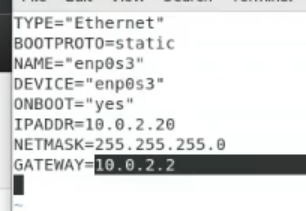

10分
nfs network file system(網站常見)

* getenforce 檢查是否disable
* systemctl status firewalld.service 要先stop防火牆
```
//server
yum install -y nfs-utils
vim /etc/exports
要分享的資料夾 要分享給誰
ex:/mynfs 192.168.56.0(rw,sync,fsid=0)
/mynfs 192.168.56.0(rw,sync,no_root_squash,no_all_squash) 安全性較高 chmod 755
systemctl start rpcbind
systemctl start nfs-server
systemctl status rpcbind
systemctl status nfs-server
rpcinfo -p
exportfs -r
exportfs
若要讓client 可以寫 chmod 777 filepath
systemctl restart rpcbind
systemctl restart nfs-server

//client
systemctl start rpcbind
systemctl status rpcbind
showmount -e server端的ip
mount -t nfs server'sip:filePath localpath
解除掛載umount filepath
```

* 建議的設ip方式(可以在同一個介面卡新增多個ip位置) 
   * ip addr add 192.168.1.3 brd + dev eth0 
brd支援brodcast
* 刪掉
   * ip addr del 192.168.1.3 dev eth0
* 更換換介面卡mac 
   * ifconfig enp0s8 hw ethwer 00:01:02:03:04:05
* 設定內定路由
   * ip route add default via 192.168.56.2

另一個10分用network設定網路
```
先ifconfig
記住inet netmask broadcast
先ip route show
記住 內定路由ip
systemctl stop NetworkManager
systemctl disable NetworkManager
systemctl start network
cd /etc/sysconfig/network-scripts/
vim 介面卡名稱然後設定
```

```
systemctl restart network

dns server
vim /etc/resolv.conf
9.9.9.9
```
期末考  network active NetworkManager  關閉的