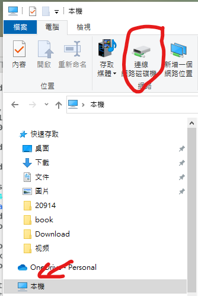
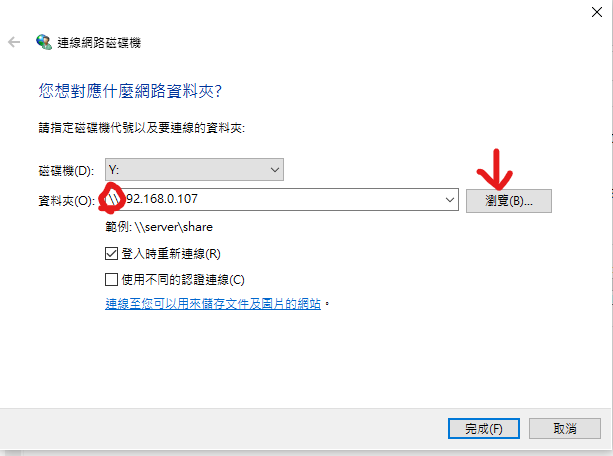

samba 
yum install samba samba-client samba-common -y
cd / 
mkdir mysamba
vim /etc/samba/smb.conf

systemctl restart smb
systemctl status smb
smbpasswd -a root 

登入後下次 登入會免密登入，導致無法切換使用者
要切換使用者 要先在terminal 
打net user * /delete

要讓大家都可以讀取資料夾
把valid users = root 刪掉 
加上 public = yes
restartx

chmod 777 mysamba

考試可能會考:
其中一個資料夾大家都可以存取
另一個資料夾只有tom可以存取

ping -c 5 8.8.88
-c 加上數字 可以設定要傳的封包數
ping -c 100 8.8.8.8 -i 0.01
-i 加上數字 設定傳送封包的頻率
-I 設定從哪個網路卡介面傳出去
-t 設定ttl
-s 設定封包大小
-Q tos

traceroute 追蹤從傳送到目地端中間所有的router

netstat -tunlp 
t tcp 
u udp
n not resolve 如果沒這個參數，不會顯示80port 會顯示http
l listen
p process

netstat -tunlp | grep 80| wc -l
非零值代表port上服務有開啟，零值服務沒開啟

windows 上也有類似的指令
netstat -an | findstr 443

vulunhub 很多虛擬機，可以學習一些網路的攻防
dockerhub
CTF capture the flag 
nmap -sP ip 可以掃描區域網路
ex:nmap -sP 192.168.157.0/24
nmap -A ip 掃描目的機器那些port是開的

msfconsole 搜尋有無漏洞的平台

search drupal
use 2
show options

猜密碼軟體 john the ripper

$searchsploit drupal

locate 34992.py 找這支程式的位置
找到後把他cp到本地端
執行程式
find / -user root -perm -4000
suid 提權

xinetd 頻率較低的service
standalone 頻率較高常駐service
第一支程式 systemd 取代init