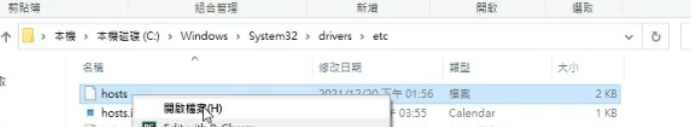

httpd連接到某個網頁需要登入
cd /var/www/html
mkdir files
echo "aaa" > a.htm
vim /etc/httpd/conf/httpd.conf
隨便找個地方加入
```
<Dierctory /var/www/html/files>
  AllowOverride AuthConfig
</Directory>
```
密碼檔第一次不存在所以要建立  
htpasswd -c .htpasswd user  
然後輸入密碼  ㄋ
vim .htaccess
```
AuthType Basic
AuthName "Private File Area"
AuthUserFile /var/www/html/files/.htpasswd
Require valid-user

virtual host
cd /etc/httpd/conf.d
vim vhosts.conf
```
```
//vhosts.conf
<VirtualHost _default_:8080>
   ServerName www.example.com
   DocumentRoot /var/www/html
</VirtualHost>
<VirtualHost *:8080>
   ServerName test1.example.com
   DocumentRoot /var/www/vhosts/test1
</VirtualHost>
<VirtualHost *:8080>
   ServerName test2.example.com
   DocumentRoot /var/www/vhosts/test2
</VirtualHost>
```
```
mkdir -p /var/www/vhosts/test1
mkdir -p /var/www/vhosts/test2
cd /var/www/vhosts/test1
echo "test1.example.com" > index.html
cd /var/www/vhosts/test2
echo "test2.example.com" > index.html
systemctl restart httpd
```


無法直接儲存在當前資料夾，要先存在其他地方再複製  
另外必須去除副檔名，參考[檢視附檔名](https://blog.gtwang.org/windows/windows-10-show-filename-extension-tutorial/)

dhcp dora  
先在虛擬機 新增網路卡 vm ware 選擇LAN segment  
測試內定路由是否可以ping  
server:
```
ip addr add 192.168.10.1/24 brd + dev ens34
```
clinet:
```
systemctl stop NertworkManager
ifconfig ens33 0
ip addr add 192.168.10.2/24 brd + dev ens33

```
server:
```
yum install dhcp
vim /etc/dhcp/dhcpd.conf

subnet 192.168.10.0 netmask 255.255.255.0 {
    range 192.168.10.100 192.168.10.200;
    option routers 192.168.10.1;
    option domain-name-servers 8.8.8.8;
    default-lease-time 600;
    max-lease-time 7200;
}
systemctl restart dhcpd.service
```
client:
```
ifconfig ens33 0
dhclient ens33
netstat -rn
```

NAT server

client:
```
ps -ef | grep dhclient
kill 原本的
dhclient ens33

```
server:
```
cat /proc/sys/net/ipv4/ip_forward (如果是1代表已經打開)
 
可以用echo 0 > /proc/sys/net/ipv4/ip_forward 修改
iptables -t nat -A POSTROUTING -s 192.168.10.0/24 -o ens33 -j MASQUERADE
