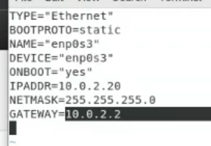
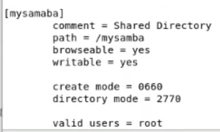
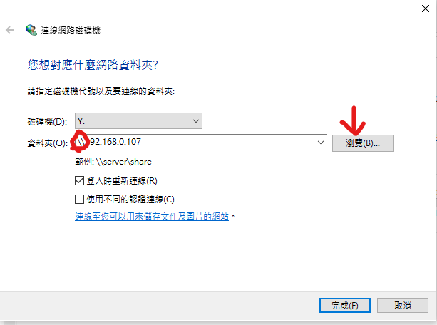

# 0927
## rpm 已編譯好，只要下載安裝到指定位置就可以了
* 在Linux下安裝軟體包，主要有3種辦法
 1. rpm工具（redhat package manager，手動安裝，難點在於包的依賴關係）
rpm包類似於windows下的.exe檔案，安裝路徑和檔名基本都是固定的。
rpm -ivh [rpm完整包名] 
 2. yum工具（python開發出來的工具，操作物件rpm包，能自動解決軟體包的依賴關係，是最常用的方式）
yum install -y 【包名簡稱】
 3. 原始碼包（需要通過編譯器把該原始碼包編譯成可執行的檔案）【安裝難度大】  
./configure---->make---->make install
  * 例如安裝htop 先google 搜尋到檔案後 wget下載下來 然後cd到htop ./configure---->make---->make install 即可安裝完成
## x86 是64位元的作業系統
## 在linux若要下載網路上的檔案，可執行 wget 加上檔案的網址即可立即下載
# 1004
tr -d


期末:
ssh 裝起來 可以用putty 或另一外一台機器連，就有5~10分的分數  
```
///ssh
$systemctl start sshd  
$systemctl status sshd  
$ifconfig  
$ssh user@ip -p 22  
```
加分:  
```
//無密碼登入   
產生公鑰
client:  
$ssh-keygen  
$cd root/.ssh/  
id_rsa 私鑰  
id_rsa.pub 公鑰 要把這邊的內容 放到另一台機器上  
$ssh-copy-id root@ip  

有些環境ssh不是內建

//server端:  
$cd root/.ssh/  
authorized_keys 會有剛剛傳過來的key  
```
可能可以加分:  
https://www.wevg.org/archives/ssh-add-mfa/  
某些os可能需要自行安裝openssh-server  
windows 連 linux   
使用putty 或winscp  
```
//linux傳給linux  
a copy to b 
scp src user@ip:dis  
copy a folder  
scp -r srcfolder user@ip:dis   
a copy from b  
scp user@ip:src dis  
```
```
///更改hostname  
$hostnamectl set-hostname name  
$bash  
```
* seq  
```
產生1到12  
seq 1 12  
產生1357911  
seq 1 2 11  
補齊   
seq -w 1 2 11  
分割  
seq -s "+" 1 10 | bc   
bc是文字計算機 參數-s 及"+"把 預設的分隔符號換成+號  
```
* sort   
-g   
-k   
-r  
-t  

* uniq 要讓全部不重複要先sort  

* cut  分隔
-d',' 分隔符  
-f column  
echo | $RANDOM | md5sum | cut -c 1-8  

* split  


# 1025
老師分享新名詞 metaverse(跨產業整合的一個領域 包括ar vr blockchain 醫療 等等)
vulunhub 很多虛擬機可供資安練習

* nmap -sP 當前區網ip(ex:192.168.56.0/24)  
 用於掃描區網裝置的ip

* namp -A ip 看更多的資訊，比如現在這台機器有開啟什麼服務

接收端:nc -l 4444 > a.txt
傳送端:nc ip 4444 < a.txt

* alias 取別名
   * unailas 取消別名
   * 暫時取消加反斜線ex: \cp a.txt b.txt
   * 回到家目錄 修改.bashrc 若希望alias 在每個視窗都能生效

* echo "$variable name"
   * "雙引號會取變數值
   * '單引號不會

* echo -e
# 1101
* 資安常識-盡量用無痕模式，在網頁上把password屬性去除掉就可以把****的密碼顯示出來了

* test 0是trye 1是false  
   * -d 是否為目錄
   * -e 是否存在
   * -s 檔案大小是否為0
   * -r 是否可讀
   * -x 是否可執行
   * -L

* which bash 找出bash位置

* #!bash path

* bash -x 
* 0 檔案的名稱 $1 $2 $3.... cli 輸入的value

apache mysql 期末會考
```
apache:
先切su

yum install httpd

systemctl status firewalld 看防火牆關了沒
systemctl disable firewalld
getenforce
如果不是disabled
要修改 /etc/selinux/config
+上SELINUX=disabled 
然後重開機
systemctl start httpd
```
```
mariadb
yum install mariadb-server mariadb
systemctl start mariadb.service
systemctl status mariadb
mysql_secure_installation

mysql -uroot -p

show databases;
create database testdb;
use testdb;
create table addrbook(name varchar(50) not null, phone varchar(10));
insert into addrbook(name,phone) values ("tom", "1234567890');
insert into addrbook(name,phone) values ("marry", "0987654321");
select * from addrbook;
```
```
php
yum install php php-mysql
systemcrl restart httpd
cd /var/www/html
vim test.php
```
hi.php

```php
#hi.php
<?php
$servername="localhost";
$username="root";
$password="user";
$dbname="testdb";

$conn = new mysqli($servername, $username, $password, $dbname);

if ($conn->connect_error) {
    die("conneciton failed: ". $conn->connect_error);
}
//echo "connection ok"

$sql="select name,phone from addrbook";
$result=$conn->query($sql);

if($result->num_rows>0){
   while($row=$result->fetch_assoc()){
      echo "name:". $row["name"]." phone:". $row["phone"]."<br>";
   }
}
?>
```
# 1115
10分
nfs network file system(網站常見)

* getenforce 檢查是否disable
* systemctl status firewalld.service 要先stop防火牆
```
//server
yum install -y nfs-utils
vim /etc/exports
要分享的資料夾 要分享給誰
ex:/mynfs 192.168.56.0(rw,sync,fsid=0)
/mynfs 192.168.56.0(rw,sync,no_root_squash,no_all_squash) 安全性較高 chmod 755
systemctl start rpcbind
systemctl start nfs-server
systemctl status rpcbind
systemctl status nfs-server
rpcinfo -p
exportfs -r
exportfs
若要讓client 可以寫 chmod 777 filepath
systemctl restart rpcbind
systemctl restart nfs-server

//client
systemctl start rpcbind
systemctl status rpcbind
showmount -e server端的ip
mount -t nfs server'sip:filePath localpath
解除掛載umount filepath
```

* 建議的設ip方式(可以在同一個介面卡新增多個ip位置) 
   * ip addr add 192.168.1.3 brd + dev eth0 
brd支援brodcast
* 刪掉
   * ip addr del 192.168.1.3 dev eth0
* 更換換介面卡mac 
   * ifconfig enp0s8 hw ethwer 00:01:02:03:04:05
* 設定內定路由
   * ip route add default via 192.168.56.2

另一個10分用network設定網路
```
先ifconfig
記住inet netmask broadcast
先ip route show
記住 內定路由ip
systemctl stop NetworkManager
systemctl disable NetworkManager
systemctl start network
cd /etc/sysconfig/network-scripts/
vim 介面卡名稱然後設定
```

```
systemctl restart network

dns server
vim /etc/resolv.conf
9.9.9.9
```
期末考  network active NetworkManager  關閉的
# 1122
```
//samba 
yum install samba samba-client samba-common -y
cd / 
mkdir mysamba
vim /etc/samba/smb.conf
```

```
systemctl restart smb
systemctl status smb
smbpasswd -a root 
```
一開始windows打ip一直無法連線所以上網找其他方式  

  
後來發現原來是要用\\\\+ip而不是//+ip   
登入後下次 登入會免密登入，導致無法切換使用者   
要切換使用者先在terminal   
打net user * /delete   清楚連線紀錄

```
//要讓大家都可以讀取資料夾  
把valid users = root 刪掉   
加上 public = yes  
chmod 777 mysamba  
然後restart服務 

 
```
考試可能會考:  
其中一個資料夾大家都可以存取  
另一個資料夾只有tom可以存取  
# 課本內容
* ping -c 5 8.8.88
   * -c 加上數字 可以設定要傳的封包數
   * ping -c 100 8.8.8.8 -i 0.01
   * -i 加上數字 設定傳送封包的頻率
   * -I 設定從哪個網路卡介面傳出去
   * -t 設定ttl
   * -s 設定封包大小
   * -Q tos

* traceroute 追蹤從傳送到目地端中間所有的router

* netstat -tunlp 
  * t tcp 
  * u udp
  * n not resolve 如果沒這個參數，不會顯示80port 會顯示http
  * l listen
  * p process

* netstat -tunlp | grep 80| wc -l
* 非零值代表port上服務有開啟，零值服務沒開啟

* windows 上也有類似的指令
* netstat -an | findstr 443

* vulunhub 很多虛擬機，可以學習一些網路的攻防
* dockerhub
``` 
//CTF capture the flag 
nmap -sP ip 可以掃描區域網路
ex:nmap -sP 192.168.157.0/24
nmap -A ip 掃描目的機器那些port是開的

msfconsole 搜尋有無漏洞的平台

search drupal
use 2
show options

猜密碼軟體 john the ripper

$searchsploit drupal

locate 34992.py 找這支程式的位置
找到後把他cp到本地端
執行程式
find / -user root -perm -4000
suid 提權
```
xinetd 頻率較低的service  
standalone 頻率較高常駐service  
第一支程式 systemd 取代init  
# 1129
load balancer hardwer F5 software LVS HAPROXY  
vip:vitrual ip  在load balancer上  
rip:real ip 在實際的server上  
load balancer還有分成l4及l7的[可參考](https://jaminzhang.github.io/lb/L4-L7-Load-Balancer-Difference/)


* load balancer
```
//pc1 
getenforce
systemctl status firewalld
yum install epel-realease
yum install haproxy -y
cp /etc/haproxy/haproxy.cfg cp /etc/haproxy/haproxy/haproxy.cfg.bak 

```
在原本的cfg貼上
```
global
  daemon
  chroot /var/lib/haproxy
  user haproxy
  group haproxy
  stats timeout 30s

defaults
  mode http
  log global
  option httplog
  option dontlognull
  timeout connect 5000
  timeout client 50000
  timeout server 50000

frontend http_front
  bind *:80
  stats uri /haproxy?stats
  default_backend http_back

backend http_back
  balance roundrobin
  server server_name1 192.168.5.3:80 check 
  server server_name2 192.168.5.4:80 check
```
開啟haproxy後如無法順利連上 有可能是本機上的80port已經被占用  
可以用netstat -tunlp | gerp 80 確認  
```
pc2 (server1)
systemctl start httpd
vim /var/www/html/index.html
內容打centos 7-2 
pc3 (server2)
systemctl start httpd
vim /var/www/html/index.html
內容打centos 7-3
```
老師後來有用ubuntu 壓力測試伺服器  
30000 request 共10用戶 一台server和兩台server  差距不到0.5秒  
30000 request 共100用戶 一台server和兩台server 差距大概1.5秒  
自己衍伸的問題:1.是否因為load balancer效能不夠 所以差異不明顯  
2.請求的資料過於簡單 只有一行文字

# 課本
* systemd (unit service install)
* systemctl
* systemctl | grep sshd
* atd服務 即時性的
* crond服務 週期性任務
* 可以用systemctl cat service 來查看service的描述檔

多人cli模式systemctl isolate multi-user.target  
多人gui模式systemctl isolate graphical.target    
若isolate 改set-default 則是把模式設為開機默認  
.service程序載入ram持續執行  
.socket當有client請求才會載入ram執行  
systemd的目錄在/usr/lib/systemd  
早期用service 現在用systemctl較多  
kill只能砍一支process pkill可以連同children一起砍掉  
# 1206
期末考預定在1月3號  
服務分為兩大類  
standalone  獨立執行  
xinetd  代理  

telnet 用xinetd代理 (若實做應該有10分)
```
su
yum install telnet
yum install telnet-server
rpm -qa | grep xinetd <!--check if already install xinetd -->
yum install -y xinetd
cd /etc/xinet.d/
vim telnet
```
```
service telnet

{
    flags = REUSE
    socket_type = stream
    wait = no
    user = root
    server = /usr/sbin/in.telnetd
    log_on_failure += USERID
    disable = no
}
```
* socket_type   
  * dgram 用udp  
  * stream 用tcp

啟動
```
systemctl start xinetd
systemctl status xinetd
netstat -tunlp | grep 23
用putty 選擇telnet 然後要改port:23

ps -ef | grep telnet 可以看telnet是否有啟動
```
* 與系統排程有關的服務
  * crond 週期性任務
  * atd 基本執行一次而已
  * crontab 中的path要絕對目錄，不可以用相對目錄

* 網頁伺服器
   * apache
   * nginx
* 常見框架lamp/lnmp
   * linux (apache/nginx)mysql php

/var/www/html 網頁伺服器的家目錄  
/var/log/httpd log儲存的地方  
access_log 可以了解客戶來源  
error_log 可能會紀錄一些攻擊的行為，可以由此了解駭客在嘗試什麼攻擊，並做一些防禦  
/etc/httpd/conf/httpd.conf http伺服器的配置檔  
若有改設定要systemctl restart httpd  

讓每個user都有自己的網頁 (5分)[參考](https://www.ltsplus.com/apache/rhel-centos-7-enable-userdir)  
```
vim /etc/httpd/conf.d/userdir.conf   
UserDir 預設是disable的，要先enabled  
UserDir public_html #拿掉  
systemctl restart httpd  
su - user 切換使用者  
mkdir public_html  
cd public_html  
echo "hello i am user1" > index.html  
要先把使用者資料夾以及public_html的權限設755  
chmod 755 public_html  
到 user的網頁要輸入 ip/~user/index.html
```
掛載不在 /var/www/html 的資料夾，使之不用在/var/www/html 也可以連線  
```
//以在根目錄的 /myweb 目錄為例  
cd /
mkdir myweb
chmod 755 myweb
在/etc/httpd/conf/httpd.conf的最底下加入
```
```
Alias /bbb /myweb     
<Directory /myweb>
  Require all granted
</Directory>
```
此時就可以連到ip/bbb (bbb是myweb的別名)
# 1213
cd /etc/httpd/conf
vim httpd.conf 


* 檔案伺服器ftp(not secure通常只在內網用) (10分upload and download)
   * FTP out-of-band 一個port傳commnad若需要傳data會另外再開一個port(20)傳完即關閉
   * ssh talnet in-band data和commnad 在同一個port
```
yum install vsftpd -y
systemctl start vsftpd
systemctl status vsfptd

netstat -tunlp | grep 21
用cmd登入
ftp ip
user: anonymous
passwrod:隨便

ftp 在linux上的家目錄為/var/ftp/
ftp有主動跟被動模式
chroot 改變家目錄的位置 主要是為了安全性
傳檔前先切bin模式
get filename (get file from server)
prompt off (關閉互動)
mget
put
prompt off (關閉互動)
mput
```
要注意clinet端的防火牆有無開放ftp使用否則會連不上

* clinet 要有寫的權限才可以上傳到server
* vim /etc/vsftpd/vsftpd.conf
  ```
  把anon_upload_enable=YES 的#拿掉
   systemctl restart vsftpd
  ```

* rpm -qa | grep vsftpd 檢查有無安裝
* 不讓使用者切到其他目錄
  ```
  chroot_local_user=YES
  allow_writeable_chroot=YES
  ```

* 禁止某個使用者登入
   ```
   vim /etc/vsftpd/user_list 
   把使用者加進去
   然後重開vsftpd
   ```
# 1220
httpd連接到某個網頁需要登入
cd /var/www/html
mkdir files
echo "aaa" > a.htm
vim /etc/httpd/conf/httpd.conf
隨便找個地方加入
```
<Dierctory /var/www/html/files>
  AllowOverride AuthConfig
</Directory>
```
密碼檔第一次不存在所以要建立  
htpasswd -c .htpasswd user  
然後輸入密碼  ㄋ
vim .htaccess
```
AuthType Basic
AuthName "Private File Area"
AuthUserFile /var/www/html/files/.htpasswd
Require valid-user

virtual host
cd /etc/httpd/conf.d
vim vhosts.conf
```
```
//vhosts.conf
<VirtualHost _default_:8080>
   ServerName www.example.com
   DocumentRoot /var/www/html
</VirtualHost>
<VirtualHost *:8080>
   ServerName test1.example.com
   DocumentRoot /var/www/vhosts/test1
</VirtualHost>
<VirtualHost *:8080>
   ServerName test2.example.com
   DocumentRoot /var/www/vhosts/test2
</VirtualHost>
```
```
mkdir -p /var/www/vhosts/test1
mkdir -p /var/www/vhosts/test2
cd /var/www/vhosts/test1
echo "test1.example.com" > index.html
cd /var/www/vhosts/test2
echo "test2.example.com" > index.html
systemctl restart httpd
```


無法直接儲存在當前資料夾，要先存在其他地方再複製  
另外必須去除副檔名，參考[檢視附檔名](https://blog.gtwang.org/windows/windows-10-show-filename-extension-tutorial/)

dhcp dora  
先在虛擬機 新增網路卡 vm ware 選擇LAN segment  
測試內定路由是否可以ping  
server:
```
ip addr add 192.168.10.1/24 brd + dev ens34
```
clinet:
```
systemctl stop NertworkManager
ifconfig ens33 0
ip addr add 192.168.10.2/24 brd + dev ens33

```
server:
```
yum install dhcp
vim /etc/dhcp/dhcpd.conf

subnet 192.168.10.0 netmask 255.255.255.0 {
    range 192.168.10.100 192.168.10.200;
    option routers 192.168.10.1;
    option domain-name-servers 8.8.8.8;
    default-lease-time 600;
    max-lease-time 7200;
}
systemctl restart dhcpd.service
```
client:
```
ifconfig ens33 0
dhclient ens33
netstat -rn
```

NAT server

client:
```
ps -ef | grep dhclient
kill 原本的
dhclient ens33

```
server:
```
cat /proc/sys/net/ipv4/ip_forward (如果是1代表已經打開)
 
可以用echo 0 > /proc/sys/net/ipv4/ip_forward 修改
iptables -t nat -A POSTROUTING -s 192.168.10.0/24 -o ens33 -j MASQUERADE

# 1227
DNS伺服器  
紀錄類型  
pic  
ipconfig/flushdns 清除DNS cache  
ipconfig/displaydns 顯示DNS cache  
系統放在linux的dns server在/etc/resolv.conf  
如果dig後面沒加dns server 他會自己去linux取dns server  
外網跟內網提供的ip是不一樣的  
dig  
a查IP位址  
mx查郵件伺服器  
ns查營稱伺服器  
cname查別名  
ptr由ip位址反查名稱  
hinfoDNS伺服器的系統資訊  

```
//bind
yum install bind bind-chroot bind-utils -y

systemctl start named
systemctl status named
netstat -tunlp | grep 53
dig @127.0.0.1 www.pchome.com.tw
就會得到回應 
dig @127.0.0.1 www.nqu.edu.tw
host -t A www.nqu.edu.tw 127.0.0.1
查詢成功

windows cmd
nslookup www.pchome.com.tw 192.168.56.103
查詢失敗 因為目前53號阜只用在linux本地
```

* vim /etc/named.conf  
```
找到 listen-on port 53{ 127.0.0.1; };  
改成 listen-on port 53{ any; };  
找到 allow-query { localhost; };  
改成 allow-query { any; };    
systemctl restart named  
```
windows cmd  
nslookup www.pchome.com.tw 192.168.56.103  
查詢成功  
 
管理網域  
vim /etc/named.rfc1912.zones  
內容下方加上  
```
zone "a.com" IN {
	type master;
	file "a.com.zone";
	allow-update { none; };
};
```

cd /var/named     
ls   
vim a.com.zone  
```
$TTL 600 ;10 minutes

@ IN SOA       @ user.gmail.com (
               2021031803 ;serial
               10800      ;refresh
               900        ;retry
               604800     ;epxire
               86400      ;minimux
               )
@              NS    dns1.a.com.
dns.com        A     192.168.56.103
dns1           A     192.168.56.103
www            A     192.168.56.150
eshop          CNAME www
ftp            A     192.168.56.150
abc            A     192.168.56.120
```

systemctl restart named  
host -t ns a.com 127.0.0.1  
最底下會出現 a.com name server dns1.a.com. 名字解析  
配置如果出現錯誤可使用以下兩個來檢查錯誤  
第一個無錯誤不會顯示訊息第二個無錯誤會顯示OK  
named-checkconf /etc/name.conf  
named-checkzone a.com /var/named/a.com.zone  

* 反向解析
   * vim /etc/named.rfc1912.zones       
```
zone "56.168.192.in-addr.arpa" IN {
	type master;
	file "56.168.192.in-addr.arpa.zone";
	allow-update { none; };
};
```

cd /var/named  
ls  
vim 56.168.192.in-addr.arpa.zone  
```
$TTL 600 ;10 minutes

@ IN SOA       @ user.gmail.com (
               2021031803 ;serial
               10800      ;refresh
               900        ;retry
               604800     ;epxire
               86400      ;minimux
               )
56.168.192.in-addr.arpa.   IN  NS dns1.a.com.
200.56.168.192.in-addr.arpa. IN PTR www.a.com.
150.56.168.192.in-addr.arpa. IN PTR ftp.a.com.
```
systemctl restart named  
nslookup 192.168.56.150 127.0.0.1  


